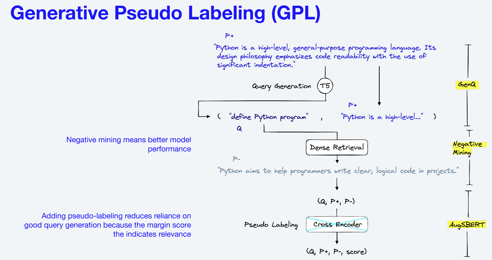
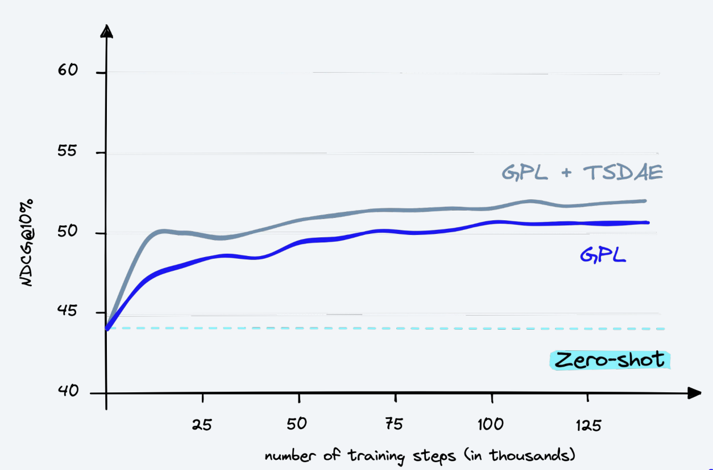

# Generative Pseudo Labeling (GPL) for Dense Retrieval Models

This Jupyter notebook guides you through the process of fine-tuning of retrieval models using Generative Pseudo Labeling (GPL). By following this guide, you will be able to domain-adapt a dense retriever model to your specific corpus of text.

## Project Description

Information Retrieval (IR) is a crucial component of many natural language processing applications. Dense retrieval methods map queries and passages to a shared, dense vector space and retrieve relevant hits by nearest-neighbor search. However, these methods require a significant amount of training data and are extremely sensitive to domain shifts.

This walkthrough helps you implement Generative Pseudo Labeling (GPL), an unsupervised domain adaptation technique for dense retrieval models on your domain data. For a collection of paragraphs from the desired domain, we utilize an existing pre-trained T5 encoder-decoder to generate suitable queries. These generated queries are used to mine negative passages. Finally, we use an existing cross-encoder to score each (query, passage)-pair and train a dense retrieval model on these generated, pseudo-labeled queries using MarginMSE-Loss.

### What is GPL?
 
Diagram 1: Source: pinecone.io/learn/gpl

### How does GPL compare to other fine-tuning methods?
 
Diagram 1: Source: K. Wang, et al., GPL: Generative Pseudo Labeling for Unsupervised Domain
Adaptation of Dense Retrieval, NAACL 2022

## Usage

You can run this notebook on the following platforms:

1. **Local machine**: The notebook makes use of CUDA for GPU acceleration. Please ensure that your system supports CUDA. If you're using a Mac, note that MacBooks currently do not support CUDA.
2. **Kaggle**: The notebook can be directly uploaded and run on Kaggle.
3. **GPU-enabled webserver**: You can also run the notebook on any GPU-enabled webserver.

## Dependencies

To run this notebook, you need to have the following Python libraries installed:

- langchain
- tiktoken
- matplotlib
- seaborn
- tqdm
- datasets
- sentence-transformers
- faiss-gpu

Additionally, you'll need a private dataset hosted on Hugging Face of the corpus from the domain selected.

## Instructions

1. Install the required Python libraries using the following command: `pip install -qU langchain tiktoken matplotlib seaborn tqdm datasets sentence-transformers faiss-gpu`.
2. Load your private dataset from Hugging Face.
3. Follow the steps in the notebook to inject domain context into the sentence transformer models using GPL.

## Expected Outcome

Upon successful execution, the dense retriever model specified in the notebook, i.e., `msmarco-distilbert-base-tas-b`, will be adapted to the domain of your input corpus using Generative Pseudo Labeling. This will improve the model's relevance and performance when retrieving information from your specific domain.

## Acknowledgments

I would like to express my appreciation for the valuable resources and learning support provided by the following projects:

- [UKPLab/gpl](https://github.com/UKPLab/gpl): This project has been instrumental in understanding and implementing Generative Pseudo Labeling.
- [pinecone-io/examples](https://github.com/pinecone-io/examples/tree/master/analytics-and-ml/model-training/gpl): The examples and tutorials in this repository have greatly facilitated my learning and application of the techniques in this project.

Thank you for making these resources available and contributing to the open-source community.
